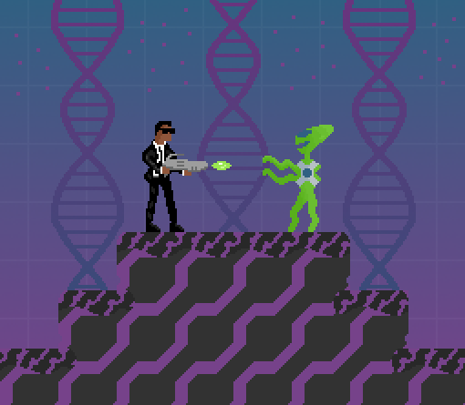

<!-- PROJECT LOGO -->
<div align="center">
  <a href="https://github.com/markdalyy/Man-v-Martian">
    
  </a>
  <h3>Man-v-Martian</h3>

  <p>
    Fun run-and-gun shooter video game (Final Year Project)
    <br />
    <a href="https://github.com/markdalyy/Man-v-Martian"><strong>Explore the project »</strong></a>
    <br />
  </p>
</div>

<!-- TABLE OF CONTENTS -->
<details>
  <summary>Table of Contents</summary>
  <ol>
    <li>
      <a href="#about-the-project">About The Project</a>
      <ul>
        <li><a href="#built-with">Built With</a></li>
      </ul>
    </li>
    <li>
      <a href="#getting-started">Getting Started</a>
      <ul>
        <li><a href="#prerequisites">Prerequisites</a></li>
        <li><a href="#installation">Installation</a></li>
      </ul>
    </li>
    <li><a href="#how-to-play">How to Play</a></li>
    <li><a href="#credits">Credits</a></li>
  </ol>
</details>

<!-- ABOUT THE PROJECT -->
## About The Project



This is a fun platform game where your character must shoot at alien enemies to try and escape from their captivity.

### Built With

* [Godot](https://godotengine.org/)

<p align="right">(<a href="#top">back to top</a>)</p>

<!-- GETTING STARTED -->
## Getting Started

Instructions on how to view the entire project locally (if you just want to play the game, <a href="#installation">skip to Installation</a>).

To get a local copy up and running follow these simple steps.

### Prerequisites

Things you need to use the software and how to install them.
* Godot

   Go to [Godot Engine Official Website](https://godotengine.org/download "Download") and download the standard 64-bit version.

### Installation
**To download the game:**

Go to the [Releases](https://github.com/markdalyy/Man-v-Martian/releases "Releases") section of this repostitory and download *Man-v-Martian.zip* under Assets.

**To view the entire project in Godot:**
1. Clone the repo or download the source code (zip) under [Releases](https://github.com/markdalyy/Man-v-Martian/releases "Releases").
   ```sh
   git clone https://github.com/markdalyy/Man-v-Martian.git
   ```

2. Open Godot and "Import" either the *project.godot* file or project zip file.
   
3. Run the project.

<p align="right">(<a href="#top">back to top</a>)</p>

<!-- HOW TO PLAY -->
## How to Play

* With the project open in Godot, press F5 on your keyboard / click on the play icon to open the game.
* Use either the arrows or WASD keys to move the player.
* Jump over obstacles by using the spacebar.
* Fire at alien enemies with the F key.
* Pause game with esc key.

<!--Click [here](https://github.com/markdalyy/Man-v-Martian "Demo") to view the demo.-->

<p align="right">(<a href="#top">back to top</a>)</p>
